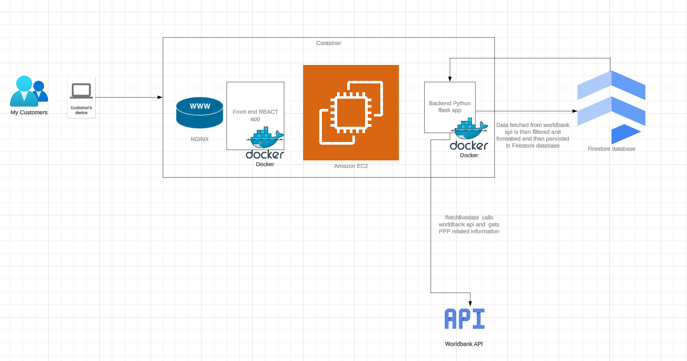
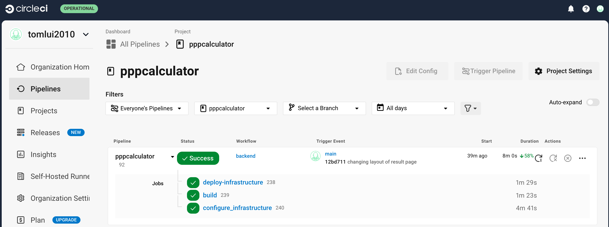
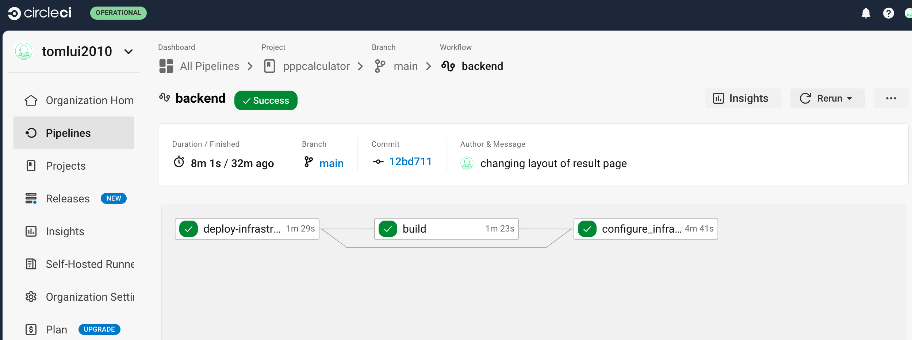

# Purchasing Power Parity Calculator (PPPCalculator)
This project implements a simple PPP calculator. This project utilises the PPP index shared by world bank via their api. 

# What is PPP? 
Imagine you and your friend live in different countries, and both of you want to buy a burger. In your country, a burger costs $5. In your friend's country, the same burger costs €4. How do you compare the value of money between these two countries? That’s where Purchasing Power Parity (PPP) comes in.

Purchasing Power Parity (PPP) is a way to compare the value of money in different countries by looking at what you can actually buy with a certain amount of money. It tells you how much things cost in one country compared to another.

Architecture: 

Frontend of the project is developed in ReactJS and served via NGINX. Backend is a Python Flask application. Firestore is used as the databse for storing country and their ppp indices.
Both frontend and backend apps are dockerized and deployed on an AWS EC2 instance. AWS EC2 instance is created using AWS CloudFormation template and configured using Ansible. 

CICD: CircleCI

